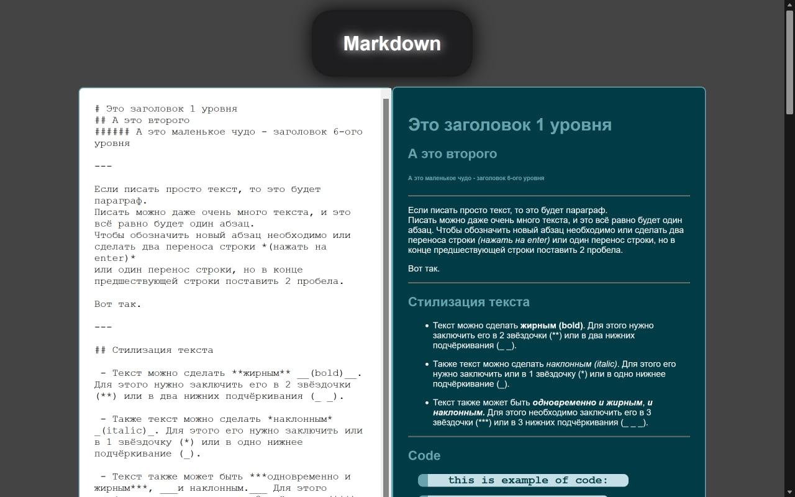
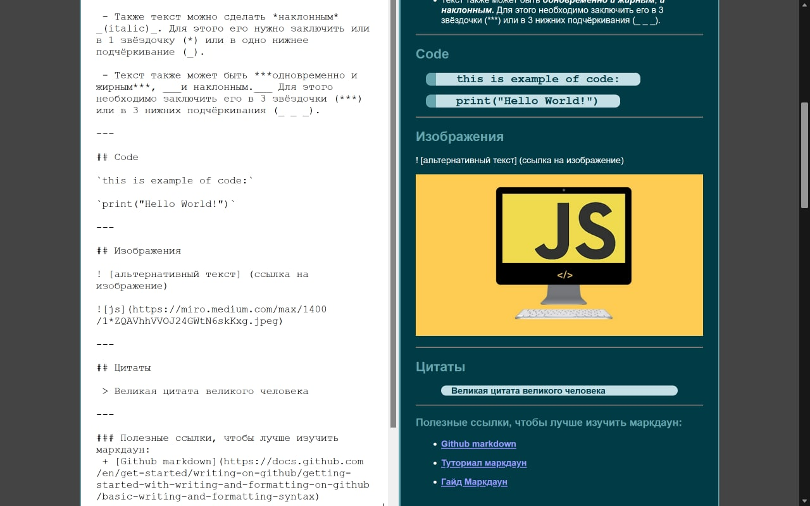
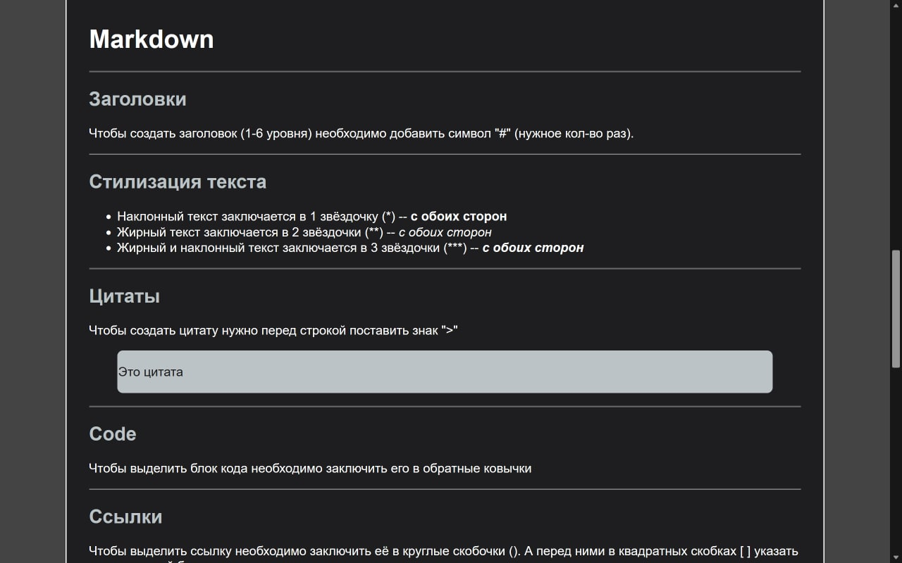
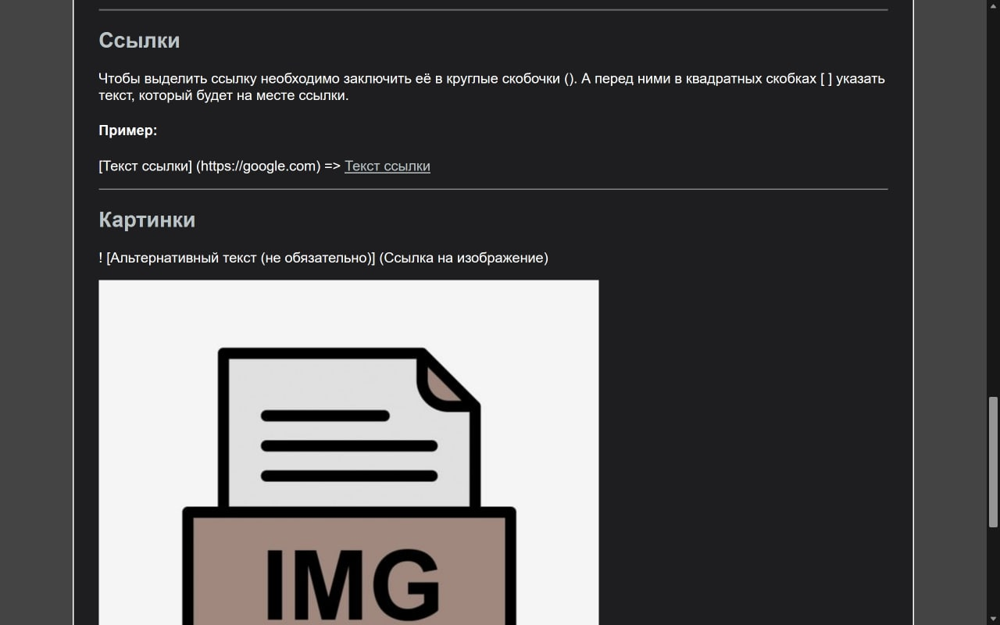

# Markdown Editor with some notes and tips about Markdown Markup

That is built in react.  
And probably one of my pet project. 

---

Version 1.1.0 notes:

Теперь доступно на телефонах.

В проекте была использована технология css grid, которая сделала проект более адаптивным и комфортным для работы на моблильных устроствах. 

> Однако работать в горизонтальном положении всё равно лучше.

---

### **Pictures of the project:**

---

## **Текст из "плейс холдера" едитора:**

# Это заголовок 1 уровня  
## А это второго
###### А это маленькое чудо - заголовок 6-ого уровня

---

Если писать просто текст, то это будет параграф.  
Писать можно даже очень много текста, и это всё равно будет один абзац.
Чтобы обозначить новый абзац необходимо или сделать два переноса строки *(нажать на enter)*
или один перенос строки, но в конце предшествующей строки поставить 2 пробела.    

Вот так.

---

## Стилизация текста

 - Текст можно сделать **жирным** __(bold)__. Для этого нужно заключить его в 2 звёздочки (**) или в два нижних подчёркивания (_ _).

 - Также текст можно сделать *наклонным* _(italic)_. Для этого его нужно заключить или в 1 звёздочку (*) или в одно нижнее подчёркивание (_).

 - Текст также может быть ***одновременно и жирным***, ___и наклонным.___ Для этого необходимо заключить его в 3 звёздочки (***) или в 3 нижних подчёркивания (_ _ _).

---

## Code

`this is example of code:`

`print("Hello World!")`

---

## Изображения

! [альтернативный текст] (ссылка на изображение)

---

## Цитаты 

 > Великая цитата великого человека

---

### Полезные ссылки, чтобы лучше изучить маркдаун:
 + [Github markdown](https://docs.github.com/en/get-started/writing-on-github/getting-started-with-writing-and-formatting-on-github/basic-writing-and-formatting-syntax)
 
 + [Туториал маркдаун](https://www.markdowntutorial.com)
 
 + [Гайд Маркдаун](https://www.markdownguide.org)
